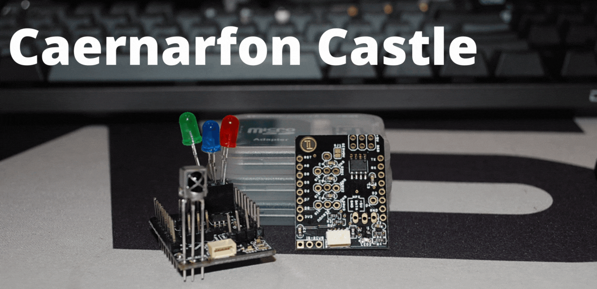
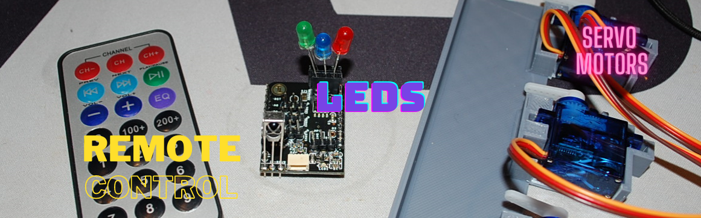
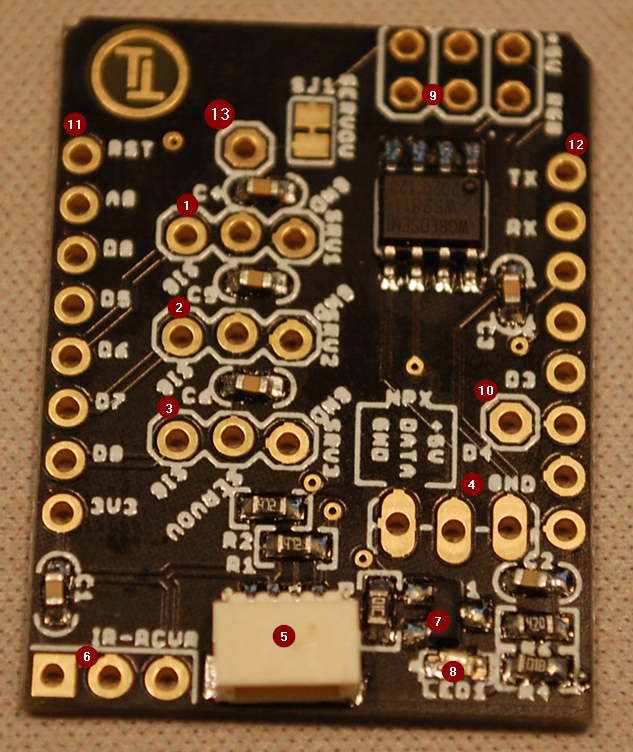
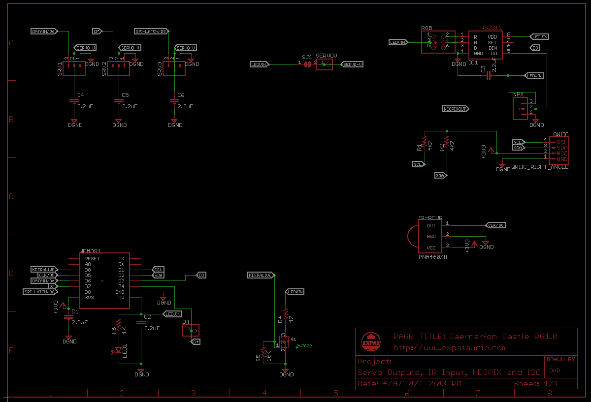

# TerrainTronics-Caernarfon-Castle

## Version Data
Current release is version PG1.0. All features have been tested individually using standard Arduino libraries.

## Introduction

The TerrainTronics Caernarfon Castle board is designed to bring interaction to your terrain. The Caernarfon castle offers:
- Ability to drive 3x Servo Motors
- Infra-Red Remote Control Receiver
- 3 Onboard LED's
- Outputs for Neopixel (WS281x) Addressable LED's
- KeepAlive Circuit (pulls ~100mA every few seconds to keep a USB battery pack awake)
- QWIIC I2C Connector to connect to external sensors etc
- 

Onboard is the ability to drive 3 Servo Motors for moving gates, doors and other light bits of terrain, work with 3 LED's directly, and address a long chain of others, Change all the lights on your terrain RED when the situation changes, and with an IR Reciever, so you can use any old remote control to send messages to your terrain to respond. 

This makes it the ultimate tool for a DM (Dungeon Master) or GM (Games Master) to make their worlds interactive, to create puzzles with real, visible outcomes - prizes or punishments!

Code examples are constantly being developed and added here. 

**Please Note** - a Wemos D1 Mini board is required to control the Caernarfon Castle board. The Wemos D1 Mini is a small microcontroller board (using ESP8266) that has a standardized small form factor, wifi capability (if you want to use it) and the ability for it to be programmed using the Arduino programming environment. Whilst installing the Arduino programming environment is required to configure your setup - you can avoid the need for actual programming by copy/pasting some of the examples here.

## Pinout of the board

<table class="tg">
<thead>
  <tr>
    <th class="tg-0pky" rowspan="14"></th>
    <th class="tg-0pky">Feature</th>
  </tr>
  <tr>
    <td class="tg-0pky">1. Servo Output (signal, power supply (5V), Ground) </td>
  </tr>
  <tr>
    <td class="tg-0pky">2. Servo Output</td>
  </tr>
  <tr>
    <td class="tg-0pky">3. Servo Output</td>
  </tr>
  <tr>
    <td class="tg-0pky">4. Neopixel output (GND, DataOut, +5V)</td> 
  </tr>
  <tr>
    <td class="tg-0pky">5. QWIIC I2C Connector</td>
  </tr>
  <tr>
    <td class="tg-0pky">6. IR Receiver - VS1838B - OUT, GND, VCC (+3.3V)</td>
  </tr>
  <tr>
    <td class="tg-0pky">7. KeepAlive Circuit</td>
  </tr>
  <tr>
    <td class="tg-0pky">8. Power Indicator (5V)</td>
  </tr>
  <tr>
    <td class="tg-0pky">9. LED Outputs from the first Neopixel</td>
  </tr>
  <tr>
    <td class="tg-0pky">10. Pin D4 output</td>
  </tr>
  <tr>
    <td class="tg-0pky">11. Left hand side strip to the Wemos D1 board</td>
  </tr>
  <tr>
    <td class="tg-0pky">12. Right hand side strip to the Wemos D1 board</td>
  </tr>
  <tr>
    <td class="tg-0pky">13. Alternative Servo Power Rail</td>
  </tr>
</thead>
</table>

| Pin | Notes about pin                | Functionality |
|-----|--------------------------------|---------------|
| D0  | No PWM possible                | KEEPALIVE     |
| D1  | Often used as SCL              | I2C-SCL       |
| D2  | Often used as SDA              | I2C-SDA       |
| D3  | No Pulldown allowed            | NEOPIXEL OUT  |
| D4  | LED. No Pulldown Allowed       | LED           |
| D5  | Often used for SPI-CLK         | IR IN         |
| D6  | Often used for SPI-COPI        | SERVO1        |
| D7  | Often used for SPI-CIPO        | SERVO2        |
| D8  | No Pullup Allowed (Fail Boot). | SERVO3        |

the "notes about pin" come from the Wemos D1 Mini documentation. Effort has been made to make the Caernarfon Castle board compatible with other boards in the Terrain Tronics ecosystem, please note however that the Harlech Castle board cannot be used with the Caernarfon, as the IR IN and SPI-COPI (Controller Out Peripheral In) are used for different uses. However, Neopixels can be used in place of Harlech boards if needed.

## Unboxing and Assembly

The Caernarfon Castle board is delivered without the pins having been soldered, however, you should find the pins in the package. This is to allow you to populate whichever pins are needed for the functionality that you are working towards, or, if system height is a concern, to solder wires directly into the holes.

The strips on the left and right hand side of the board are mandatory, to be used to stack and connect to a Wemos D1 Mini. Most Wemos D1 Mini boards are sold without soldered connectors either. In my experience it's easier to put female headers on the Wemos D1, then downard facing male connectors on the Caernarfon board. 

In the box, you will find:
1x Caernarfon Board
2x 40pin Pin headers
2x 8pin long leaded female headers
1x VX1838B IR Reciever

## Functionality

### Servo's (not included)

For motors that can turn an arm between 0 and 180 degrees, servo motors can be used. Servo motors have been used in model aircraft and train sets for years. They are quite easy to use, as you set the angle of deflection needed, and the servo motor will turn to that angle, and using it's own internal feedback, hold that position. The controller, or your software doesn't need to be concerned about measuring or holding the angle etc - simply tell the servo (using code) where to turn to - and it just does!
In the demo code, it's used as a gate to hold a boulder from rolling down and hurting the adventurers.

3 servo motors can be connected to the Caernarfon Castle board and can be addressed in Wemos D1 Arduino code on pins D5, D6 and D7. A library called Servo.h (a standard Arduino library) is used and can be downloaded from the internal GUI.

Servo's can be connected on to the 3-pin strips in the middle of the board. They should be connected as SIGNAL-POWER-GND. Most servo's are colour coded in Orange (Signal), Red (Power), Brown/Black (Ground). I've had some success with SG90 Servo's. They are the smallest kind on Amazon, but very usable.

### LED's (not included)

The board has a WS2811 onboard. This is a chip that the wemos d1 board talks to with LED values. It has 4 outputs. 3 of them are for LED's and one (DOUT) is used to send on to the next in the chain. Such a daisy chain of LED's can pull a lot of current (power), so you may need an external 5V power supply that can provide enough current. For a handful of LED's, you should have no trouble.
Pin D3 is used to send data. The Adafruit NEOPIXEL library can be used to send data.

### I2C Output compatible with Sparkfun QWIIC and Adafruit Stemma QT (Connector onboard)

The board has a standardized I2C connector (4 pin SH connector). The SDA and SCL Pins (used for I2C) are mapped to pins D1 and D2. There are two 4K7Ohm resistors used as pullups. As this is just a connector, external devices will have to be programmed as and when you need them.
Breakout cables are available from Amazon, Sparkfun and Adafruit.

### USB Powerbank Keepalive circuit

A transistor wired to put power through a small resistor is used to pull a surge of current every few seconds. This is used to convince some USB Power Banks to stay on, as many will go into a sleep mode and stop delivering power if there isn't enough power being drawn. The Keep Alive circuit pulls around 90mA-110mA when activated on pin D0.
No specific library is required to toggle pin D0, but be aware that the board is going to get hot quite quickly if you leave it on! 5V at ~100mA means approximately 0.5W of power will be dissipated in a device smaller than a grain of rice. Switch is on for a second, then off again! :)
In my code, I use the "ticker" library (#include <Ticker.h>). When you use a ticker function, you essentially set a software based timer that will run the code every few seconds (or however long you like). The accuracy isn't perfect, but it should be set to be often enough to keep a battery pack alive! :)

### Infra Red Reciever for remote control (included)

VX1383B IR recievers are bundled with the kit. This IR reciever is designed to recieve most standard remote control signals and convert them into the electrical pulses that are decoded by the Wemos D1 Mini. 
Data is brought in on pin D5. 
I've used the IRremoteESP8266: IRrecvDemo to prove functionality. (it spits out the code driven by the remote on the computer screen). I then take that code (e.g. "FF30CF")
and change my code to respond in some way to that code - change the light, move a servo etc.
This allows you to use an off the shelf low cost remote control, or even recycle that remote control that in the junk drawer to control your terrain!
Care should be taken in which way the receiver is connected. Please see the image for reference. The reciever can be wired offboard if you want to hide your controller deep under the foam but show the IR reciever on a specific part of the terrain. 

 
## Schematic and Theory of Operation

[PDF OF THE SCHEMATIC](Caernarfon_Schematic_PG1p0.pdf)

** The text below is from the Conwy board -- need to rewrite ** 
The board functions a current source and 4 current mirrors.
R1,R2 and Q1 sets the reference current in the circuit.
Q2 through Q5 then mirror that current if they can. So an LED connected between the +5V (or your battery positive voltage) and the Drain (the top) of the transistor Q2-Q5 will switch on, then only allow the same amount of current through it that goes through Q1. E.g. if Q1 is set up for 10mA, then regardless of the color of the LED, only 10mA will be passed through it.

As mentioned in section 1 – each color LED drops a different voltage, but many are rated for the same brightness at a specific current. 
 
 
